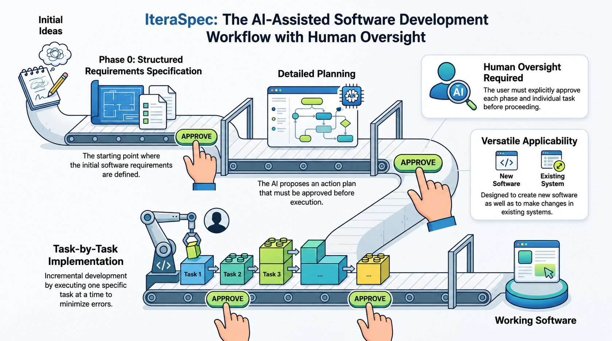

# IteraSpec

IteraSpec is a human-approved AI workflow for building new software or changing existing systems through specification, planning, and one-task-at-a-time implementation.



## Usage

Give your AI assistant one of these instructions:

```text
Sigue estrictamente `ITERASPEC.md` como protocolo principal de este proyecto. Léelo completo antes de actuar y obedécelo literalmente.
```

```text
Follow `ITERASPEC.md` strictly as the main protocol for this project. Read it completely before acting and obey it literally.
```

Then let it start from `Phase 0` and approve each phase and task explicitly.

When IteraSpec asks for approval, you can answer with `[A]prueba` or just `a`. If you do not approve, just say what you want changed.

Each feature or functionality handled with IteraSpec should keep its own workflow artifacts inside `.iteraspec/<feature_name>/`, for example `.iteraspec/user-authentication/specs.md`, `.iteraspec/user-authentication/backlog.md`, `.iteraspec/user-authentication/board.md`, and `.iteraspec/user-authentication/current_task.md`.

In the task catalog, each `TNN` task should explicitly reference one associated `RNN` refinement. A single refinement may group multiple tasks.

The GUI expects stable Markdown structures for `status.md`, `backlog.md`, `board.md`, and `current_task.md`. Use the canonical artifact formats documented in [`ITERASPEC.md`](/home/prezdev/git-projects/itera-spec/ITERASPEC.md).

IteraSpec should also maintain a global file at `.iteraspec/status.md`. On a new session, the AI should inspect that file first to understand which feature, phase, and next step are currently active.

## Reuse In Another Project

If you want to reuse IteraSpec in another repository, copy at minimum:

- `ITERASPEC.md`

If you also want the GUI viewer, copy these files into a `gui/` directory at the root of the target project:

- `gui/app.py`
- `gui/run.sh`
- `gui/requirements.txt`

Expected structure in the target project:

```text
your-project/
  ITERASPEC.md
  .iteraspec/
    status.md
    <feature_name>/
      specs.md
      backlog.md
      board.md
      current_task.md
  gui/
    app.py
    run.sh
    requirements.txt
```

The GUI reads `.iteraspec/` from the root of the target project. Run it with:

```bash
cd gui
./run.sh
```
